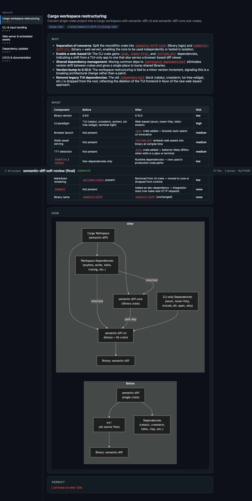

# semantic-diff

A web-based diff viewer with AI-powered semantic grouping.



## What it is

`semantic-diff` reads a unified diff (from your working tree, a file, stdin, or a GitHub PR), groups the hunks by *intent* using an AI CLI (Claude Code, GitHub Copilot, or Cursor), and serves an interactive review SPA on `127.0.0.1`. It auto-opens your browser to a per-diff URL and streams review sections (WHY / WHAT / HOW / VERDICT) into the page over Server-Sent Events as the LLM finishes them.

The Rust binary embeds the SvelteKit SPA via `include_dir!`, so there is nothing to install beyond the binary and one of the supported AI CLIs.

## Quick start

Install from source (no published release yet):

```bash
cargo install --path crates/semantic-diff-cli
```

Then, from any git repo:

```bash
semantic-diff                    # review unstaged changes
```

The server binds to a loopback port and your browser opens automatically. The URL is also printed to stderr.

## Inputs

| Flag | Description |
|------|-------------|
| *(none)* + trailing `git_args` | Run `git diff -M <args>`. Examples: `semantic-diff`, `semantic-diff --staged`, `semantic-diff HEAD~3..HEAD`, `semantic-diff main..feature` |
| `--diff <FILE>` | Read a unified diff from a file (e.g. a saved `.patch`) |
| `--stdin` | Read diff from stdin (auto-detected when piped) |
| `--pr <URL_OR_REF>` | Fetch via `gh pr diff`. Accepts `https://github.com/owner/repo/pull/123` or `owner/repo#123` |
| `--result <FILE>` | Replay mode: serve an existing `result.json` |
| `--history` (alias `--browse`) | Pick from past saved reviews |
| `--title <STR>` | Header label shown in the SPA |
| `--port <PORT>` | HTTP port. Default `0` (OS-assigned). Env: `SEMANTIC_DIFF_PORT` |
| `--output <DIR>` | Where `result.json` is written. Default: `~/.local/share/semantic-diff/results/<id>/` |
| `--no-open` | Don't auto-open the browser |
| `--no-llm` | Skip LLM grouping and review (renders the diff only) |
| `--llm-providers <LIST>` | Provider fallback order. Default `claude,copilot,cursor`. Env: `SEMANTIC_DIFF_LLM_PROVIDERS` |

Examples:

```bash
semantic-diff                          # unstaged changes
semantic-diff HEAD~3..HEAD             # commit range
semantic-diff --staged                 # staged changes
semantic-diff --diff patch.patch       # from a diff file
semantic-diff --pr owner/repo#123      # from a PR
git diff HEAD~5 | semantic-diff --stdin
semantic-diff --history                # browse past saved reviews
```

## Configuration

Config lives at `~/.config/semantic-diff.json` (JSONC; auto-created on first run):

```jsonc
{
  // Which AI CLI to prefer ("claude" or "copilot"). Optional;
  // default fallback order: claude → copilot → cursor.
  // "preferred-ai-cli": "claude",

  "claude":  { "model": "haiku" },         // haiku | sonnet | opus (or tier alias)
  "copilot": { "model": "gemini-flash" }   // sonnet | opus | haiku | gemini-flash | gemini-pro
}
```

Fields:

- **`preferred-ai-cli`** — moves the named provider to the front of the fallback chain. Equivalent to passing `--llm-providers <name>,<rest>`.
- **`claude.model`** — model tier passed to `claude -p --model …`.
- **`copilot.model`** — model tier passed to `copilot --model …`.

> A `/settings` UI is planned but not built yet — see [ROADMAP.md](ROADMAP.md). For now, edit the JSON file directly.

## LLM providers

`semantic-diff` shells out to whichever AI CLI you have installed. It does **not** read or store API keys — auth is delegated entirely to the upstream CLI.

| Provider | Binary | Install | Login |
|----------|--------|---------|-------|
| **Claude** | `claude` | `npm install -g @anthropic-ai/claude-code` | run `claude` and follow its prompts |
| **Copilot** | `copilot` (falls back to `gh copilot --`) | `npm install -g @github/copilot` *or* `gh extension install github/gh-copilot` | use the CLI's own auth flow (or `gh auth login`) |
| **Cursor** | `cursor-agent` (falls back to `cursor agent`) | Cursor IDE → "Install cursor-agent CLI" | sign in via Cursor IDE |

Invocation details:

- Claude: `claude -p --output-format <json|text> --model <…>` with the prompt on stdin.
- Copilot: `copilot --allow-all-tools --model <…>`.
- Cursor: `cursor-agent -p --output-format text --trust --workspace . <prompt>`. Model is not configurable; Cursor's default is used.

If the first provider's binary is missing, rate-limited, or auth-failed, `semantic-diff` logs the error and tries the next one in the fallback list.

## Result artifacts

| Artifact | Path |
|----------|------|
| Per-run result | `~/.local/share/semantic-diff/results/<id>/result.json` |
| Grouping cache | `<git-dir>/semantic-diff-cache.json` |
| Per-section review cache | `<git-dir>/semantic-diff-cache/reviews/<content_hash>.json` |

`<id>` is the first 8 hex chars of `blake3(diff || title)`, so the same diff replays to the same URL.

There are no log files — `tracing` writes to stderr; control verbosity with `RUST_LOG` (e.g. `RUST_LOG=semantic_diff=debug`).

To share a review, copy the result directory:

```bash
cp -r ~/.local/share/semantic-diff/results/<id> /tmp/share/
# the recipient can replay with:
semantic-diff --result /tmp/share/<id>/result.json
```

To delete one:

```bash
rm -rf ~/.local/share/semantic-diff/results/<id>
```

## Architecture

```mermaid
flowchart TD
    A[Input: file / stdin / gh pr diff / git diff -M] --> B[Orchestrator]
    B --> C[Compute id = blake3 diff||title]
    C --> D[Boot axum server on 127.0.0.1<br/>open browser at /r/id]
    B --> E[Parse diff → DiffData]
    E --> F[Write empty result.json]
    F --> G[LLM grouping<br/>claude → copilot → cursor]
    G --> H[Detect review skill]
    H --> I[Spawn parallel tasks:<br/>group × WHY/WHAT/HOW/VERDICT]
    I --> J[Atomic write result.json<br/>+ SSE notify]
    J --> K[SvelteKit SPA<br/>refetches on each event]
    I --> L[Cache successful per-group reviews]
```

Three runtime modes: normal (live diff), `--result <file>` (replay), and `--history` (picker over past saved reviews).

## Skills

Reviews can be customized by dropping a "review" skill into `.claude/skills/`. Discovery order:

1. `./.claude/skills/` (project-local — checked first)
2. `~/.claude/skills/` (global)

The first entry whose **name (case-insensitive) contains `review`** wins. It can be either:

- a **flat file** of any extension (e.g. `.claude/skills/review.md`), or
- a **subdirectory** containing `SKILL.md` (e.g. `.claude/skills/code-review/SKILL.md`).

The skill's contents are injected into the VERDICT-section prompt. If no skill is found, the built-in review prompt is used. Cached reviews are invalidated automatically when the resolved skill source changes.

Minimal example — `.claude/skills/review.md`:

```markdown
# Review criteria

- Flag any new `unwrap()` or `panic!` in non-test code.
- Call out missing tests for new public functions.
- Prefer security/correctness comments over style nits.
```

## FAQ / troubleshooting

**Browser didn't open.** Use the URL printed to stderr (looks like `http://127.0.0.1:54321/r/abcd1234`). On headless boxes, pass `--no-open` and tunnel the port over SSH.

**`claude: command not found`.** Install with `npm install -g @anthropic-ai/claude-code`, then run `claude` once to authenticate. Same idea for `copilot` and `cursor-agent`.

**Rate-limited on Claude.** Skip it for this run: `semantic-diff --llm-providers copilot,cursor`. Or set `SEMANTIC_DIFF_LLM_PROVIDERS=copilot,cursor` in your shell.

**Stale review (e.g. you tweaked your skill).** Delete the cache and re-run:

```bash
rm -f .git/semantic-diff-cache.json
rm -rf .git/semantic-diff-cache/reviews
```

**No LLM at all.** Pass `--no-llm` to render just the diff with no grouping or review.

## Development

```bash
# Rust binary + library
cargo build
cargo test

# SvelteKit SPA (rebuild before `cargo build` to refresh embedded assets)
cd web
pnpm install
pnpm build
```

Repo layout:

- `crates/semantic-diff-cli/` — binary crate (clap CLI, axum server, embedded SPA, orchestrator).
- `crates/semantic-diff-core/` — library (diff parsing, grouping, review, `llm_cli`, config, result schema, cache).
- `web/` — SvelteKit SPA. Built into `web/build/` and embedded via `include_dir!`.
- `tests/` — Rust integration tests.
- `scripts/` — helper scripts (e.g. `scripts/check-readme.sh`, `scripts/smoke.sh`).
- `docs/` — architecture and feature notes (in progress).

### Browser E2E tests (Playwright)

A Playwright-based browser test suite lives at `web/tests/e2e/`, implementing
the plan at [`.kilo/plans/v2-browser-test-plan.md`](.kilo/plans/v2-browser-test-plan.md).
It covers shipped Wave A/B/C features (F1, F2, F3, F4, F5, F6, F7, F8, F9, F12,
F13, F15) plus the F10 README pre-flight and the cross-cutting axe / console /
CSP / SSE checks.

Run from the repo root:

```bash
# One-time install
cd web/tests/e2e && npm install && npx playwright install chromium

# Run all suites (globalSetup builds web + cargo and spawns the binary)
cd web/tests/e2e && npx playwright test --reporter=list

# …or use the bundled wrapper that tees output to /tmp/e2e-run.log
web/tests/e2e/run-and-log.sh
```

Layout:

- `web/tests/e2e/playwright.config.ts` — chromium-only, `workers=1` (single
  shared server), `fullyParallel=false`.
- `web/tests/e2e/globalSetup.ts` — runs `scripts/check-readme.sh` (F10),
  conditionally rebuilds `web/build/`, runs `cargo build --release`, spawns the
  binary on `--port 0`, parses the URL from stderr, polls `/api/results` until
  non-empty, and exports `BASE_URL` / `RESULT_ID` to all workers.
- `web/tests/e2e/globalTeardown.ts` — `SIGTERM` → 5 s grace → `SIGKILL` of the
  spawned binary.
- `web/tests/e2e/fixtures.ts` — extends `test` with `baseURL` / `resultId`,
  plus a `replayServer(fixturePath)` helper that stages a fixture into a fresh
  `<tmpdir>/<id>/result.json` layout and spawns a second `--result …` instance.
- `web/tests/e2e/tests/*.spec.ts` — one spec per F-number plus
  `cross-cutting.spec.ts` (axe, console errors, CSP, SSE smoke).
- `tests/fixtures/results/sample.v3.json` (id `50258e5e`) — minimal v3 schema
  sanity, generated from a live `--no-llm` run.
- `tests/fixtures/results/sample-with-issues.json` (id `feedface`) — populated
  `verdict_issues` + `metadata.tokens` for replay-mode F13 / F6-tokens suites.

#### Known limitations

The plan was implemented in full to the spec, but a few items diverge from the
document and are documented here so the suite stays honest about what it
actually proves:

- **Suite has not been run end-to-end to green from the agent that wrote it.**
  The harness, fixtures, replay JSONs, and all 13 spec files exist on disk and
  are wired up correctly, but the suite has not been run to a fully passing
  state. Run `web/tests/e2e/run-and-log.sh` locally and triage failures
  against `.kilo/plans/v2-browser-test-plan.md`.
- **F8 multi-result history seeding.** Result IDs are deterministic
  (`blake3(diff || title)`), so spawning the same fixture twice yields one
  result, not two. The F8 suite seeds a second result by passing a unique
  `--title "F8 seed <ts>"`; if that mechanism breaks (e.g. the title stops
  feeding into the id hash), rows 1–3 / 5 fall back to `test.skip` and only
  the API-contract row 6 runs.
- **F13 group filter (row 5)** is `test.skip`'d — `sample-with-issues.json`
  only contains one group because `tests/fixtures/real-world.patch` produces
  a single group under `--no-llm`. To exercise group filtering, regenerate the
  fixture from a multi-group input.
- **F6 token block schema.** The plan calls out `prompt` / `completion` /
  `total` rows; the actual `TokenUsage` schema is
  `{ input_tokens, output_tokens, cost_usd }` and the tests assert the labels
  the SPA actually renders (`Input` / `Output` / `Cost`).
- **F13 row 7** asserts `details.raw-verdict` on `/r/:id/issues`, but the
  implementation only renders that block on `/r/:id`. The spec is written as
  the plan says and is expected to fail until either the test is relaxed to
  `/r/:id` or the markup is moved.
- **F1 row 4 visual snapshot** is gated behind `UPDATE_SNAPSHOTS=1` so it
  doesn't fail on first run; commit baselines under
  `web/tests/e2e/__snapshots__/` once they're reviewed.
- **F4 axe scan (row 5), F2 mobile slide-over (row 5), F8 keyboard shortcuts
  (row 7), F5 effective-config diff (row 11), F7 HOW prompt menu (row 6)** are
  deliberately `test.skip`'d per the plan's "deferred / out-of-scope" notes.
- **Replay log line.** The binary prints `running at <url>` for live mode and
  `Serving result at <url>` for replay mode; `fixtures.ts` matches both.
- **Stale embedding hazard.** The Rust binary embeds `web/build/` at compile
  time via `include_dir!`. If you edit a Svelte component, run
  `cd web && pnpm build && cargo build --release` (or just delete
  `target/release/semantic-diff` and re-run the suite — `globalSetup` always
  re-runs `cargo build`). If a test fails because the served HTML doesn't
  match the on-disk Svelte source, that's the cause.
- **`data-testid="tokens-block"`** was added to
  `web/src/lib/components/RunMetadataPanel.svelte` so F6 can locate the
  metadata-tokens section without fragile selectors. This is the only
  production-code change made for the test suite.

#### Wave D — not tested

F11 (run-from-UI), F17 (keyboard shortcuts / command palette), and F20 (cost
preview chart) are unimplemented. The plan deliberately contains no test cases
for them; do not back-fill empty placeholders.
